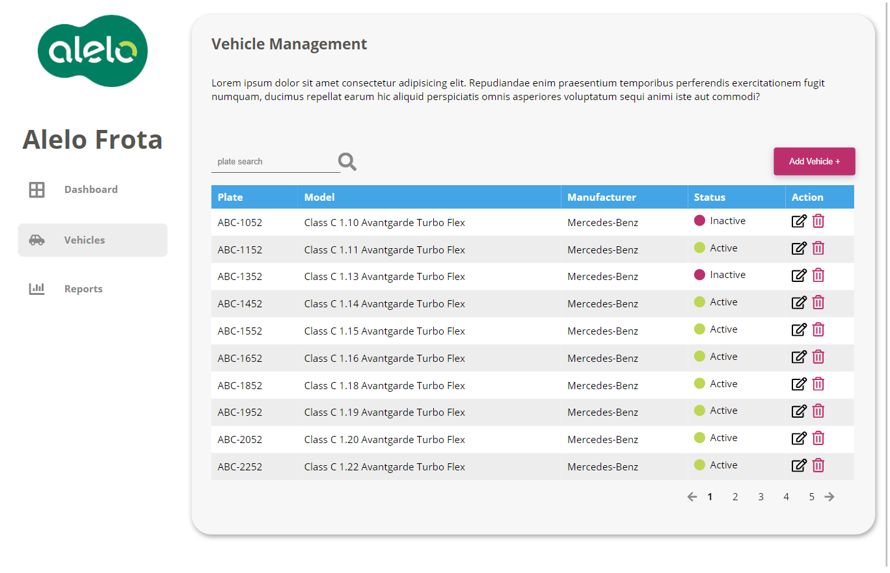
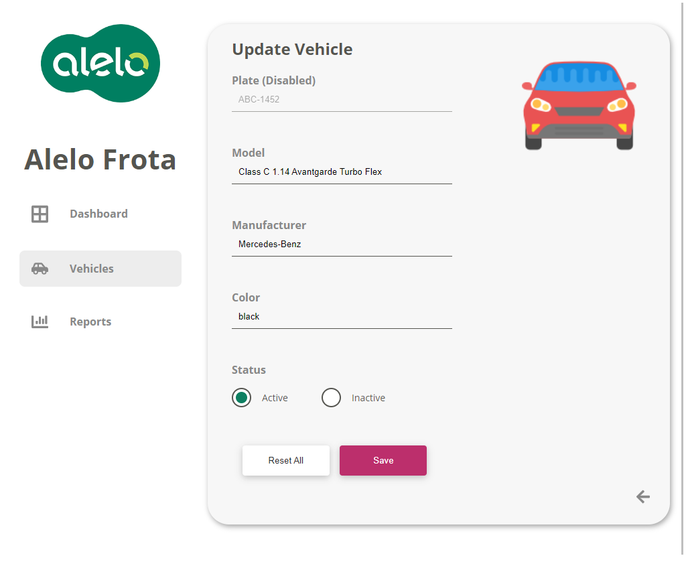
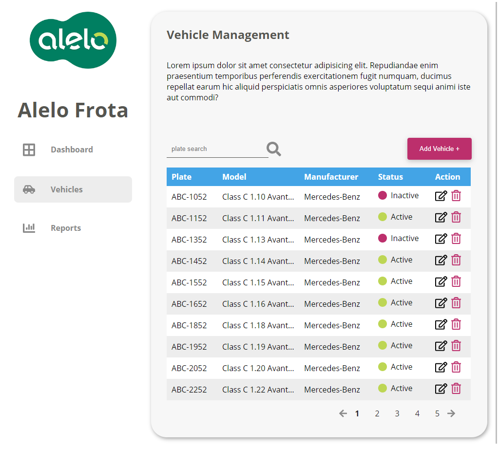
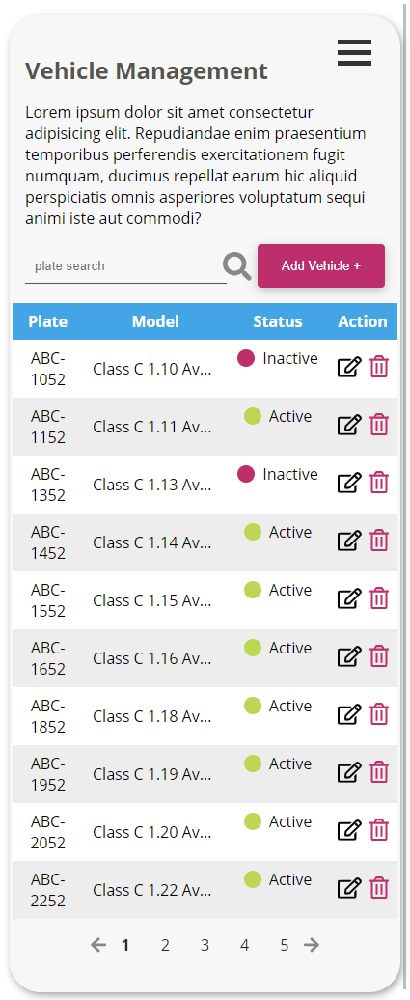
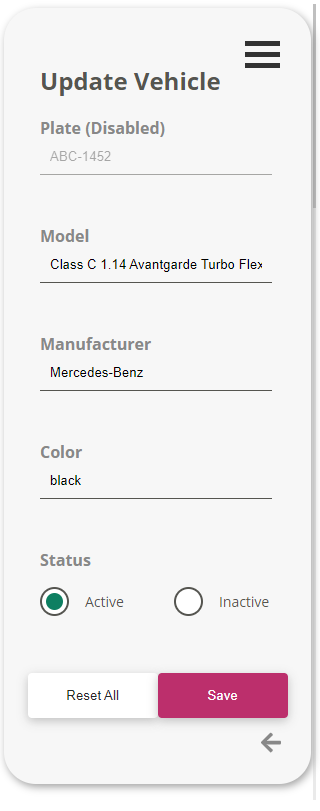
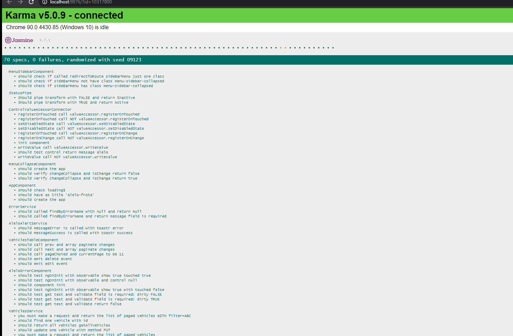
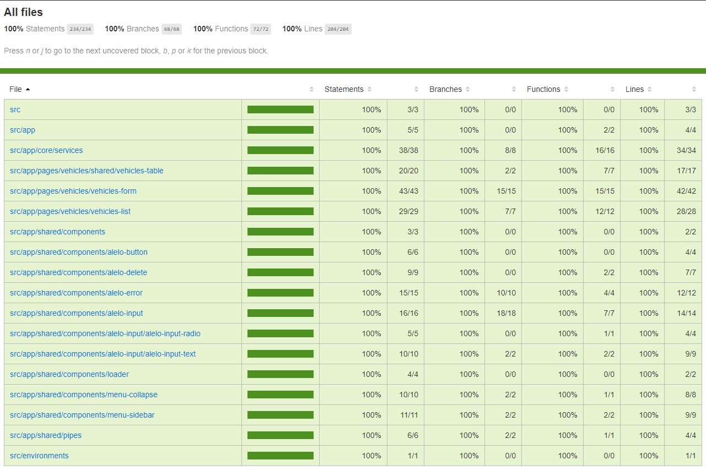

# Alelo Frota
Públicado em [https://alelo-car-test.netlify.app](https://alelo-car-test.netlify.app/)

# Alelo Frota Teste

Esse é um layout baseado no Front end teste da Alelo Frota.
https://github.com/alelofrota/front-end-test

Arquitetura

- Angular CLI version 10.1.7
- Node 14.15.5
- SCSS

## Expectativa do Desafio

- Utilização de rotas;
- Paginação
- Filtro buscando na API
- Layout responsivo
- Metodologia CSS
- Mixins, placeholders, functions, variáveis, animações, loaders...
- Rxjs
- Tratamento de erros
- Teste unitário

**Layout do desafio**: https://github.com/alelofrota/front-end-test/blob/master/LAYOUT.md

## Layout do sistema.

 1440px

  

1024px

  

1024px

  

425px

  

320px

  

## Teste unitários

  

## Cobertura

  

